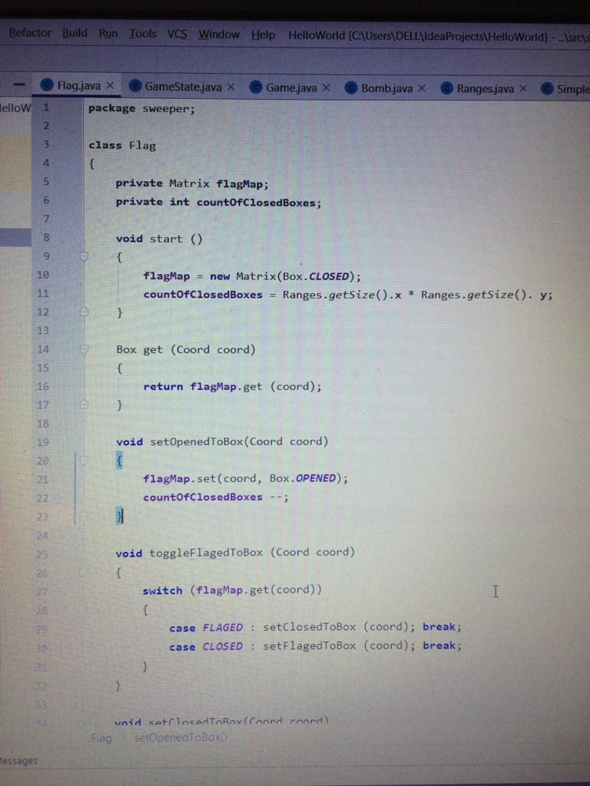
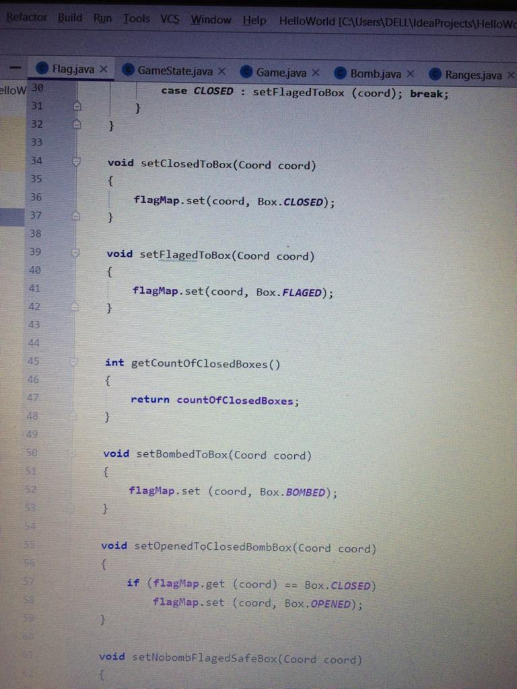
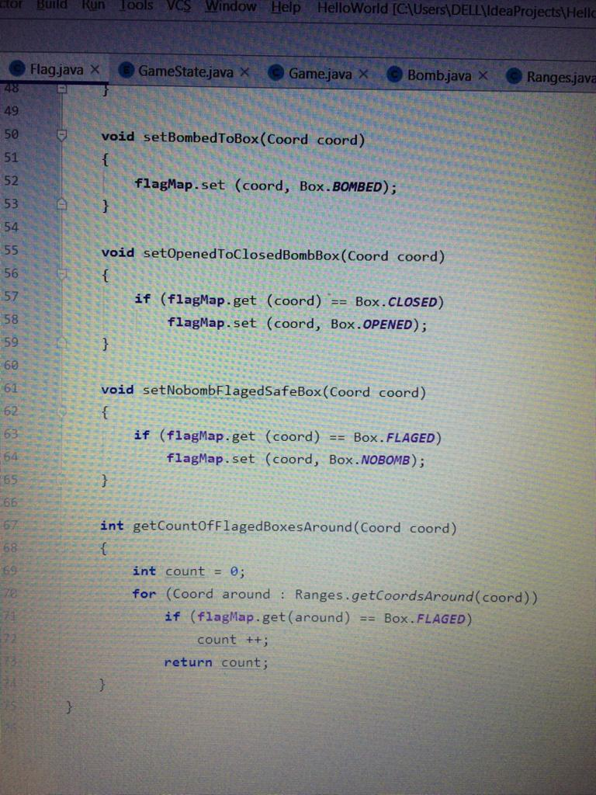
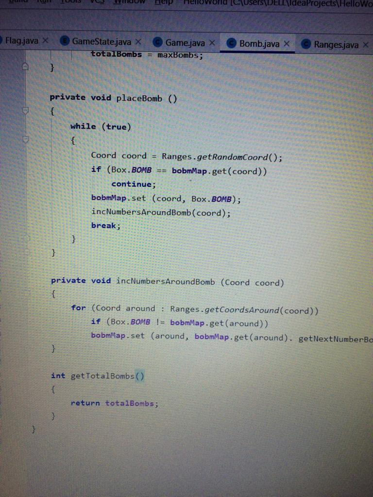
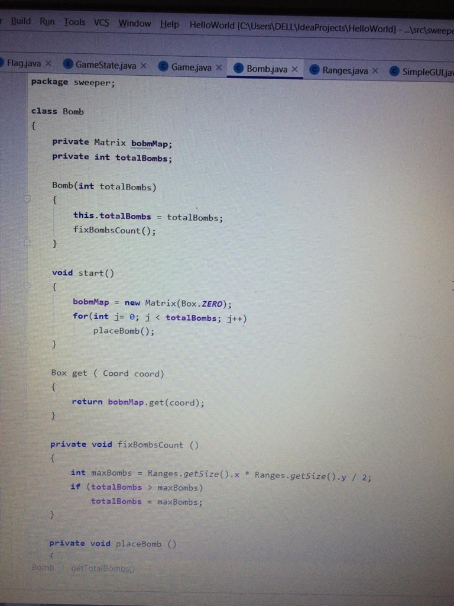
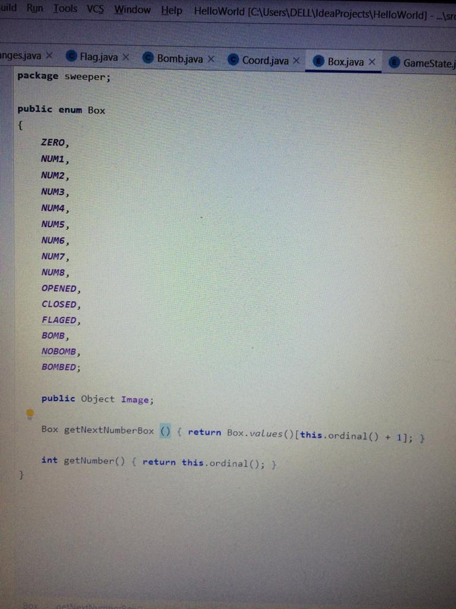
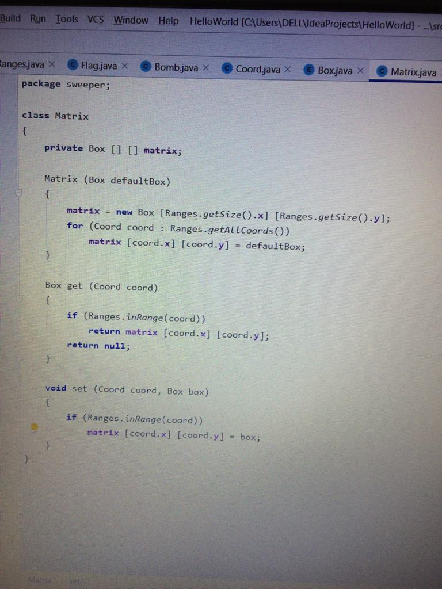

# Descripton:
The goal of the game is to open all the cells of the playing field on which there is no bomb. You will lose if you click on the cell with the bomb. If you are sure that the cell contains a bomb, you can right-click to mark it as a reminder. After you have marked all the bombs around the open cell, you can quickly open the remaining cells that are not bombs by clicking on the cell with the offset.

To help the player avoid getting into a mine, the location of the alleged mine can be marked by right-clicking on it. The game is won, as soon as all empty or numbered squares have been detected by the player, all remaining mines are not marked.

### Class Flag

### Class Bomb
This is the matrix work with the flag

### ClassCoord 

### ClassBox

### ClassMatrix

