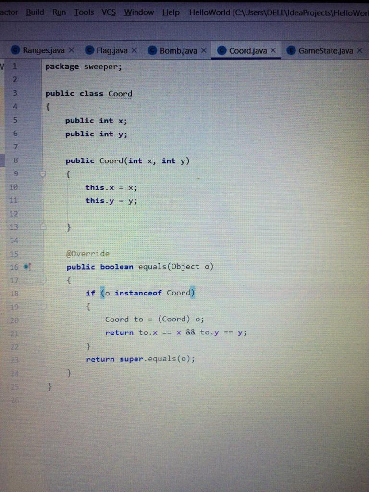
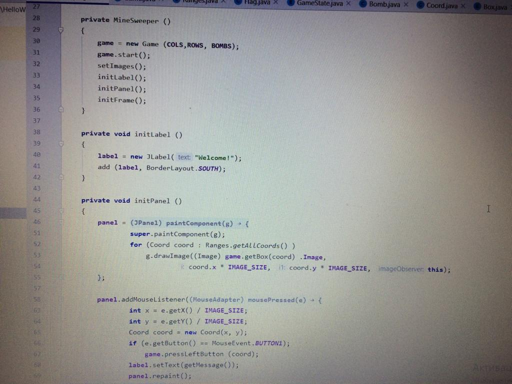

# Descripton:
The goal of the game is to open all the cells of the playing field on which there is no bomb. You will lose if you click on the cell with the bomb. If you are sure that the cell contains a bomb, you can right-click to mark it as a reminder. After you have marked all the bombs around the open cell, you can quickly open the remaining cells that are not bombs by clicking on the cell with the offset.

To help the player avoid getting into a mine, the location of the alleged mine can be marked by right-clicking on it. The game is won, as soon as all empty or numbered squares have been detected by the player, all remaining mines are not marked.

### Class Flag

### Class Bomb
This is the matrix work with the flag

### ClassCoord 

### ClassBox

### ClassMatrix

### ClassGame

###ClassGameState

### ClassMineSweeper

### ClassSimpleGUIandMain

### Description for Clases

#### 1) BOX ENUM   
there are all the pictures in order to work with them in enum box an enumeration will be created in which all the pictures of the lower and upper layers with bombs are recorded. Also to enm box need object image which use for display images. Object considered public, to Object can anyone contact it because it was easy to set the value.
We have Two functions getNumber and nextNumberBox
GetNumber – is used to know which number there is.
NextNumberBox – is used when bombs are used, the function also moves from one value to another

#### 2) Class Coord 
We use class Coord to store cell coordinates and work with all of these

#### 3)  Class Game 
in this class are everything we necessary 
Matrix – bomb, flag, gamestate
Сonstructor’s
Void start - game launch method
PressleftButton and  PressRightButton - method for pressing right and left
GettotaoBombs - how many bombs
Flags - how many flags

#### 4) Class Matrix
We use to store in Box.
 In Matrix have top flags and bottom bombs 
Also in Matrix I use constructor which fills the entire matrix in the specified field

#### 5) Class Ranges 
use to store field size
Variable size safe the size
Allcoords – use for to iterate over all elements
Random – use in oder to generate random coordinate 
Also use Set and Get
GetAllCoords -  get the whole list of coordinates
GetCoordAround - get coordinate around any cell
GetRandomCoord – get random coordinates
InRange - function determines which cell is in the field

#### 6) Class Bomb
This is the matrix work with the bomb

#### 7) Class Flag
This is the matrix work with the flag

#### 8) Class GameState
This is a class condition that the game can really show
We have 3 type of conditions
1)	PLAYED
2)	BOMBED
3)	WINNER
